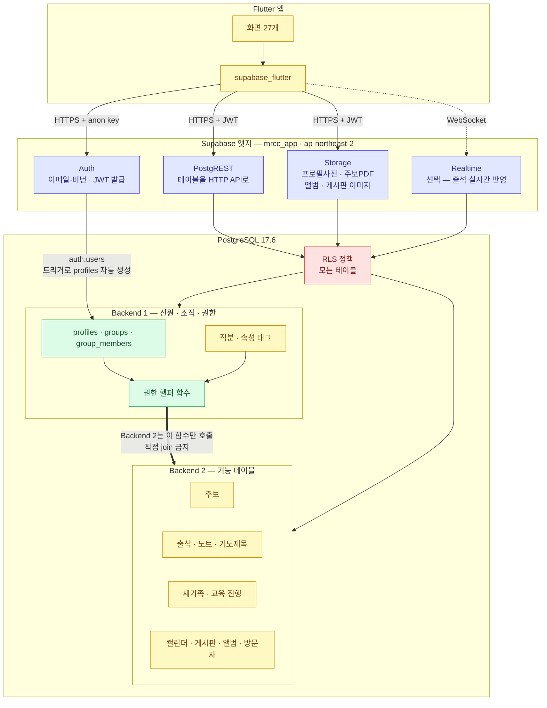
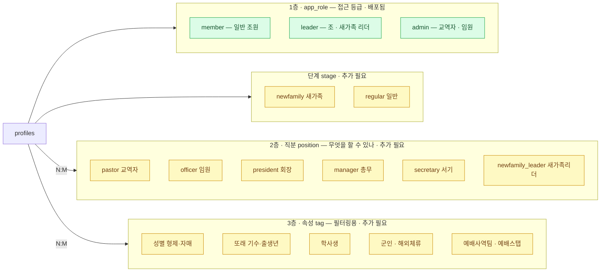
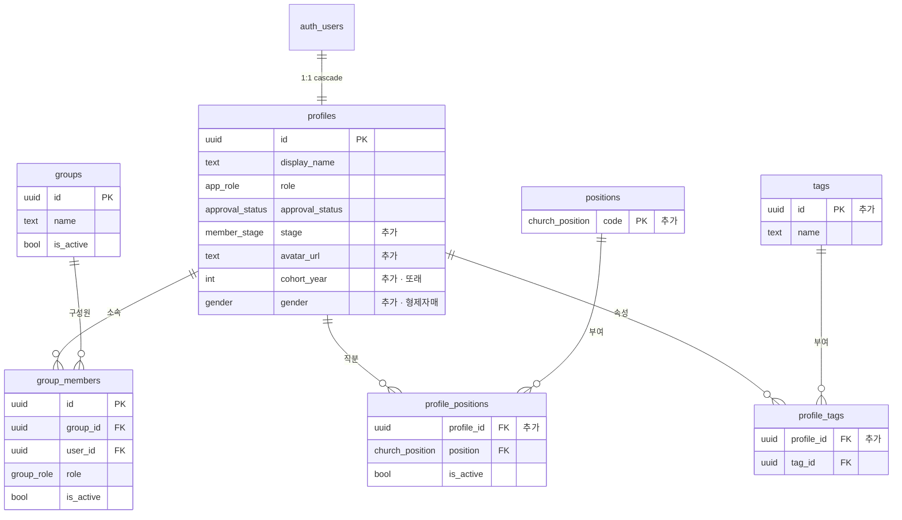
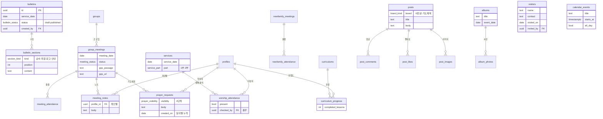
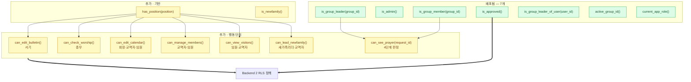
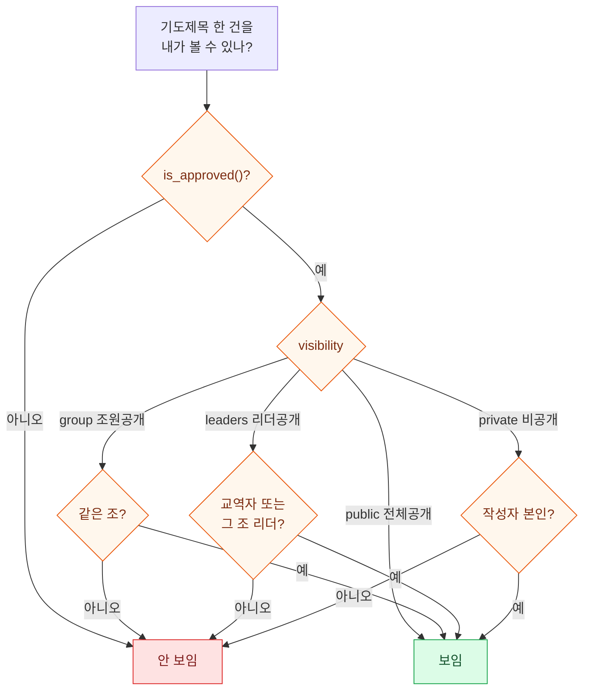
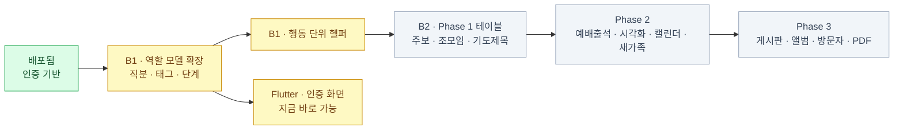

# 백엔드 아키텍처 (Architecture)

`260922` 안건을 백엔드 구조로 옮긴 설계도입니다. [화면 흐름도](./SCREENS.md)와 짝입니다.

현재 배포된 것은 **인증 기반(3개 테이블)** 뿐이고, 스펙을 다 채우려면 **테이블 약 18개**와
**역할 모델 확장**이 필요합니다. 아래에서 `[배포됨]` / `[추가 필요]`로 구분했습니다.

관련 문서: [핸드오프](./BACKEND1_HANDOFF.md) · [Backend 2 계약](./BACKEND2_RLS_CONTRACT.md) · [팀 설명용](./TEAM_WALKTHROUGH.ko.md)

---

## 1. 시스템 구조

앱 서버가 없습니다. Flutter가 Supabase와 직접 통신하고, 권한은 전부 DB 안의 RLS가 담당합니다.

굵은 화살표가 두 백엔드 사이의 **유일한 접점**입니다. Backend 2는 `profiles`나
`group_members`에 직접 join하지 않고 헬퍼 함수만 호출합니다. 그래야 나중에 조직 구조가
바뀌어도 기능 정책이 안 깨집니다.

---

## 2. 역할 모델 — 3층 분리

스펙에 등장하는 역할이 9개입니다. 그런데 성질이 서로 다릅니다.

- **총무**는 "예배 출석체크"라는 행동 하나를 하는 한 사람 → 직분
- **새가족**은 시간이 지나면 벗어나는 상태 → 단계
- **학사생 · 군인 · 해외체류 · 또래**는 역할이 아니라 사람의 속성 → 태그

이걸 `app_role` 하나에 다 넣으면 한 사람이 회장이면서 임원일 수가 없고, 필터용 속성은
들어갈 자리가 없습니다. 그래서 세 층으로 나눕니다.

직분과 속성은 **N:M**입니다. 한 사람이 회장이면서 임원일 수 있고, 학사생이면서
예배사역팀일 수 있습니다. 조 리더는 예외로 이미 `group_members.role`에 있으니 직분에
중복하지 않습니다 — 어느 조의 리더인지가 같이 필요하기 때문입니다.

`몇 주 이상 결석`과 `대예배 1·2부 출석자`는 **저장하지 않습니다.** 출석 데이터에서
계산되는 값이라 뷰나 쿼리로 뽑습니다. 태그로 만들면 반드시 실제와 어긋납니다.

---

## 3. 데이터 모델

### 3-1. 신원 · 조직 · 권한 (Backend 1)

### 3-2. 기능 테이블 (Backend 2)

### 3-3. 테이블 목록과 단계

| 테이블 | 영역 | 담당 | 단계 |
|---|---|---|---|
| `profiles` `groups` `group_members` | 신원·조직 | B1 | **배포됨** |
| `positions` `profile_positions` | 직분 | B1 | 1 |
| `tags` `profile_tags` | 속성 | B1 | 1 |
| `bulletins` `bulletin_sections` | 주보 | B2 | 1 |
| `group_meetings` `meeting_attendance` | 조모임 출결 | B2 | 1 |
| `meeting_notes` | 노트 | B2 | 1 |
| `prayer_requests` | 기도제목 | B2 | 1 |
| `services` `worship_attendance` | 예배 출석 | B2 | 2 |
| `newfamily_meetings` `newfamily_attendance` | 새가족 | B2 | 2 |
| `curriculums` `curriculum_progress` | 교육 진행 | B2 | 2 |
| `calendar_events` | 캘린더 | B2 | 2 |
| `posts` `post_images` `post_likes` `post_comments` | 게시판 | B2 | 3 |
| `albums` `album_photos` | 앨범 | B2 | 3 |
| `visitors` | 방문자 | B2 | 3 |

---

## 4. 권한 헬퍼 함수

**행동 이름으로 만드는 것**이 핵심입니다. 스펙에 "캘린더 수정 권한: 회장 혹은
교역자/임원"처럼 여러 직분이 묶여 나오는데, `can_edit_calendar()`로 감싸두면 나중에
"부회장도 추가"가 함수 한 곳만 고치는 일이 됩니다. 직분 이름으로 만들면 정책을 전부
찾아 고쳐야 합니다.

전부 기존과 같은 규칙으로 만듭니다 — `security definer`, `stable`,
`set search_path = ''`, `authenticated`와 `service_role`에만 grant.

### 가장 어려운 정책: 기도제목 4단계

작성자는 범위와 무관하게 항상 자기 글을 봅니다. 위 판정을 `can_see_prayer()` 하나로
감싸서 Backend 2가 `using (public.can_see_prayer(id))`만 쓰게 만드는 게 목표입니다.

---

## 5. Storage 버킷

| 버킷 | 용도 | 공개 | 업로드 권한 |
|---|---|---|---|
| `avatars` | 프로필 사진 | 승인된 사용자 | 본인만 |
| `bulletins` | 주보 PDF | 승인된 사용자 | 서기 |
| `album-photos` | 앨범 | 승인된 사용자 | 임원·교역자 |
| `post-images` | 게시판 이미지 | 승인된 사용자 | 작성자 |

Storage도 RLS가 걸립니다. 버킷을 public으로 만들면 URL을 아는 누구나 접근하므로,
전부 private으로 두고 정책 + signed URL로 처리합니다.

---

## 6. 구현 순서

**S1 · S2가 Backend 2를 막고 있습니다.** 총무·서기·회장이 스키마에 없으면 주보 편집
정책이나 예배 출석체크 정책을 쓸 수가 없습니다. 반면 Flutter 인증 화면은 지금 바로
시작할 수 있습니다 — 그 부분은 이미 클라우드에 배포되어 있습니다.

---

## 7. 결정이 필요한 것들

1. **직분 이름을 코드에서 영어로 쓸지 한글로 쓸지.** 위에서는 영어(`manager`,
   `secretary`)로 했습니다. 한글 enum도 PostgreSQL에서 되지만 쿼리가 번거로워집니다.
2. **총무·서기가 자동으로 admin인지.** 예배 출석체크는 전체 명단 쓰기가 필요한데,
   그러면 총무가 남의 역할도 바꿀 수 있게 됩니다. 분리하려면 컬럼 단위 정책이 필요합니다.
3. **새가족 기도제목**을 `prayer_visibility`에 5번째 값으로 넣을지, 테이블을 분리할지.
4. **또래를 기수로 볼지 출생년으로 볼지.** 필터 정확도가 달라집니다.
5. **시각화 데이터를 뷰로 만들지 클라이언트 집계로 할지.** 뷰가 빠르지만 뷰에도
   RLS 설계가 필요합니다.
6. **예배 1부/2부**를 `services`로 분리하는 게 맞는지 확인.
7. **방문자 → 정회원 승격 경로.**
