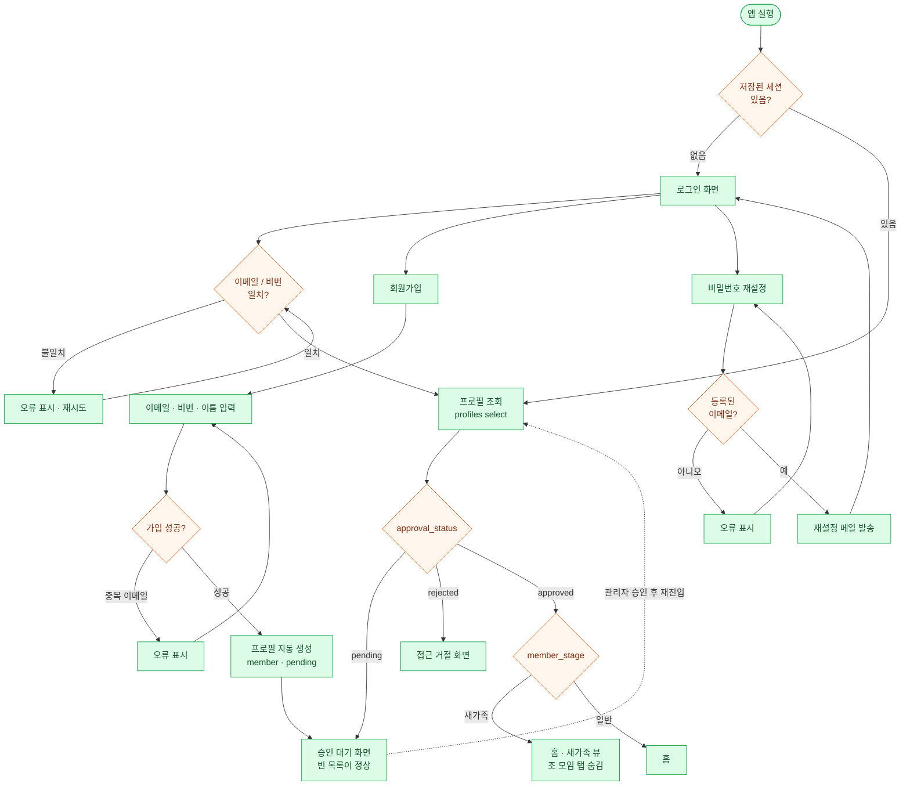
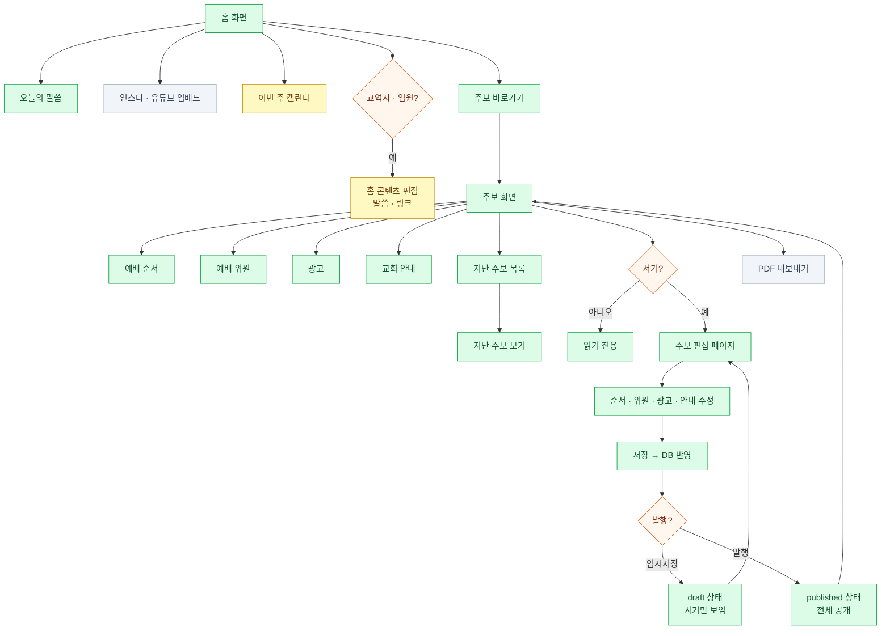
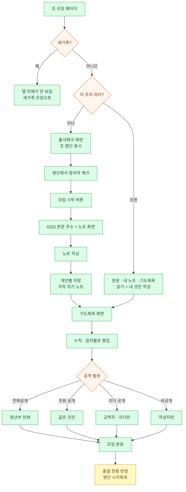
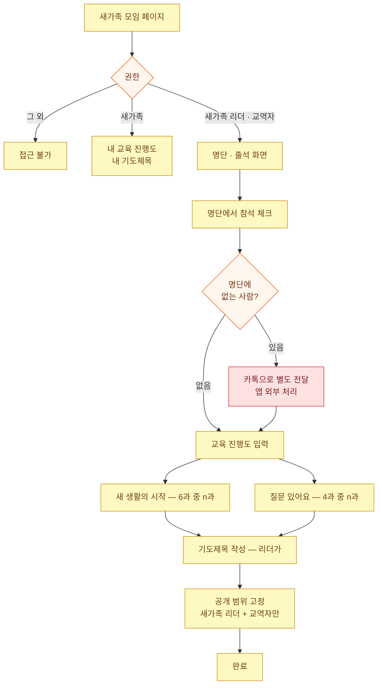
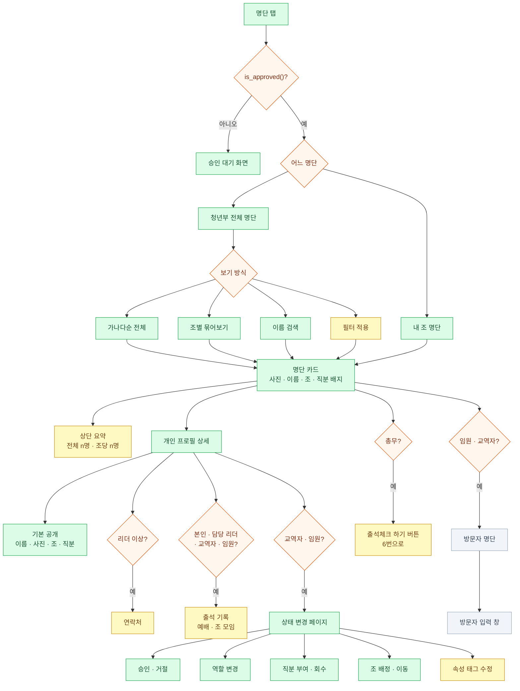
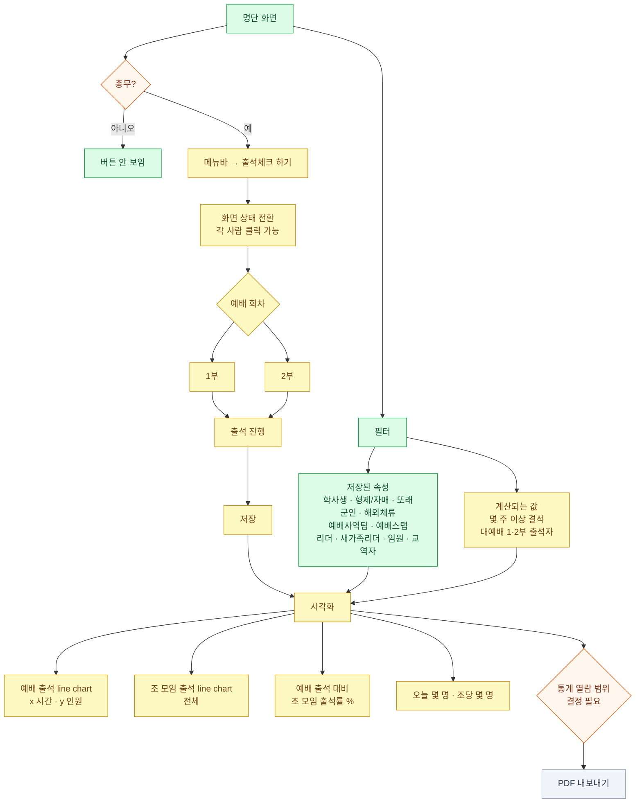
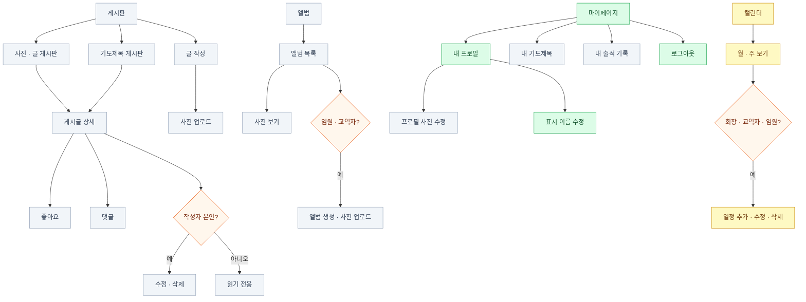

# 화면 흐름도 (Screens)

`260922` 안건 문서를 화면 단위로 정리한 흐름도입니다. 총 **32개 화면**, 7개 영역.

권한 게이트는 마름모(◇)로 표시했습니다. 색은 단계입니다.

- 🟩 **Phase 1 (MVP)** — 인증, 명단, 조 모임, 주보
- 🟨 **Phase 2** — 예배 출석, 시각화, 캘린더, 새가족 모임
- ⬜ **Phase 3** — 게시판, 앨범, PDF 내보내기, 방문자 관리

단계 구분은 제안입니다. 팀 논의로 조정하세요.

관련 문서: [백엔드 아키텍처](./ARCHITECTURE.md) · [팀 설명용](./TEAM_WALKTHROUGH.ko.md) · [Flutter 연동](./FLUTTER_AUTH_INTEGRATION.md)

---

## 0. 전체 화면 맵

네비게이션 바 후보가 스펙에는 8개(홈·명단·앨범·캘린더·주보·조모임·게시판·마이페이지)인데,
iOS/Android 하단 탭은 현실적으로 5개가 한계입니다. 아래는 **5탭 + 더보기** 안입니다.

```mermaid
flowchart TB
  Nav["하단 네비게이션"]

  Nav --> H["홈"]
  Nav --> L["명단"]
  Nav --> G["조 모임"]
  Nav --> B["주보"]
  Nav --> M["더보기"]

  M --> CAL["캘린더"]
  M --> ALB["앨범"]
  M --> BRD["게시판"]
  M --> MY["마이페이지"]

  H --> H1["오늘의 말씀"]
  H --> H2["인스타 / 유튜브"]
  H --> H3["이번 주 캘린더 요약"]
  H --> H4["주보 바로가기"]

  L --> L0["전체 · 조별 · 검색"]
  L0 --> L5["개인 프로필 상세"]
  L --> L1["필터 · 시각화"]
  L --> L2["예배 출석체크 · 총무"]
  L --> L3["상태 변경 · 교역자·임원"]
  L --> L4["방문자 명단 · 임원·교역자"]

  G --> G1["출석체크 (리더)"]
  G --> G2["GQS 본문 · 노트"]
  G --> G3["기도제목"]
  G --> G4["새가족 모임"]

  B --> B1["지난 주보"]
  B --> B2["주보 편집 (서기)"]

  BRD --> BR1["사진·글 게시판"]
  BRD --> BR2["기도제목 게시판"]

  classDef p1 fill:#dcfce7,stroke:#16a34a,color:#14532d
  classDef p2 fill:#fef9c3,stroke:#ca8a04,color:#713f12
  classDef p3 fill:#f1f5f9,stroke:#94a3b8,color:#334155
  classDef nav fill:#e0e7ff,stroke:#4f46e5,color:#312e81

  class Nav,M nav
  class H,L,G,B,H1,H4,L0,L5,G1,G2,G3,B1,B2 p1
  class CAL,L2,L3,G4,H3 p2
  class ALB,BRD,MY,BR1,BR2,L4,H2 p3
```

---

## 1. 인증 (Phase 1 — 완료)

백엔드는 이미 배포되어 있습니다. Flutter 화면만 남았습니다.

> `member_stage`(새가족 / 일반)는 **아직 스키마에 없습니다.** 스펙의 "새가족은 조 모임
> 아직 안 보이게" 요구사항을 위해 추가해야 합니다. [ARCHITECTURE.md](./ARCHITECTURE.md) 참고.

---

## 2. 홈 · 주보

주보는 링크 연결이 아니라 **앱 안에서 새로 만드는 것**으로 결정됨. 편집은 서기만.

---

## 3. 조 모임 (스펙의 핵심 플로우)

스펙 원문 그대로: 조 모임 페이지 → 리더가 출석 체크 → 모임 시작 → GQS 본문 + 노트 →
모임 → 기도제목 → 모임 완료.

**필요한 DB 3개** — 출결 현황, 노트(개인별), 기도제목. 기도제목의 4단계 공개 범위가
지금까지 만든 것 중 가장 까다로운 RLS입니다.

---

## 4. 새가족 모임 (Phase 2)

> 새가족 기도제목은 "새가족 리더 + 교역자만"이라 조 모임 기도제목의 4단계와 **다른
> 5번째 범위**입니다. 같은 테이블에 범위 하나를 더할지, 테이블을 분리할지 결정 필요.

---

## 5. 명단 (Phase 1 — 앱의 중심 화면)

> ### ⚠️ 지금 배포된 DB로는 이 화면이 **동작하지 않습니다**
>
> `profiles`의 읽기 정책은 딱 두 개입니다. `profiles_select_own`(내 행만)과
> `profiles_select_admin`(관리자는 전체). 그래서 **일반 조원이 명단을 열면 자기 혼자
> 나옵니다.** 리더도 마찬가지로 자기 행만 보입니다.
>
> 명단이 앱의 중심이라면 `profiles`에 "승인된 사용자는 승인된 사용자를 볼 수 있다"는
> 정책이 새로 필요합니다. 이건 Backend 1 작업이고, 아래 9번의 1번 결정입니다.
> 범위를 정하기 전까지 Flutter에서 명단 화면을 붙여도 빈 화면이 나옵니다.

### 명단에서 무엇이 누구에게 보이나

이게 명단 설계의 핵심입니다. 한 사람의 프로필이 통째로 공개되는 게 아니라
**항목별로 공개 범위가 다릅니다.**

| 항목 | 승인된 전체 | 담당 리더 | 교역자 · 임원 |
|---|---|---|---|
| 이름 · 프로필 사진 | ✅ | ✅ | ✅ |
| 소속 조 | ✅ | ✅ | ✅ |
| 직분 배지 | ✅ | ✅ | ✅ |
| 속성 태그 (학사생 · 군인 등) | 논의 필요 | ✅ | ✅ |
| 연락처 | ❌ | ✅ | ✅ |
| 출석 기록 | 본인만 | 자기 조원 | ✅ |
| 승인 상태 · 역할 | ❌ | ❌ | ✅ |

항목별로 다르다는 건 RLS만으로는 부족하고 **컬럼 단위 권한**이나 공개 항목만 담은
**뷰**가 필요하다는 뜻입니다. `profiles`를 통째로 열면 연락처와 승인 상태까지 딸려
나갑니다. [ARCHITECTURE.md](./ARCHITECTURE.md)의 2번 결정과 같은 문제입니다.

---

## 6. 예배 출석 · 시각화 (Phase 2)

`출석체크 하기` 버튼은 **총무에게만** 보입니다.

---

## 7. 게시판 · 앨범 · 마이페이지 (Phase 3)

---

## 8. 화면별 권한 요약

| 화면 | 열람 | 편집 |
|---|---|---|
| 홈 | 승인된 전체 | 교역자 · 임원 |
| 주보 | 승인된 전체 | **서기** |
| 지난 주보 | 승인된 전체 | 서기 |
| 청년부 명단 | **정책 추가 필요** — 현재는 본인 행만 | 교역자 · 임원 |
| 내 조 명단 | 조원 + 담당 리더 | 교역자 · 임원 |
| 개인 프로필 상세 | 항목별로 다름 — 5번 표 참고 | 본인 · 교역자 · 임원 |
| 예배 출석체크 | **총무** | **총무** |
| 방문자 명단 | **임원 · 교역자** | 임원 · 교역자 |
| 상태 변경 | 교역자 · 임원 | 교역자 · 임원 |
| 시각화 · 통계 | 범위 논의 필요 | — |
| 조 모임 | 조원 + 리더, **새가족 제외** | 해당 조 리더 |
| 조모임 출석체크 | 해당 조 리더 | 해당 조 리더 |
| 노트 | 본인 것만 | 본인 |
| 기도제목 | 공개 범위에 따라 4단계 | 작성자 |
| 새가족 모임 | 새가족 · 새가족리더 · 교역자 | 새가족 리더 |
| 새가족 기도제목 | 새가족리더 · 교역자 | 새가족 리더 |
| 캘린더 | 승인된 전체 | **회장** · 교역자 · 임원 |
| 게시판 | 승인된 전체 | 작성자 본인 |
| 앨범 | 승인된 전체 | 임원 · 교역자 |
| 마이페이지 | 본인 | 본인 |

---

## 9. 결정이 필요한 것들

1. **🔴 명단 열람 범위 — 가장 급합니다.** 지금 정책으로는 일반 조원이 명단을 열면
   자기 혼자 나옵니다. 세 가지 안 중 하나를 골라야 Flutter가 명단 화면을 시작할 수
   있습니다.
   - (a) 승인된 사람은 승인된 사람 전체를 본다 — 교회 명단이니 자연스럽고 구현이 가장 단순
   - (b) 같은 조 + 리더만 본다 — 가장 보수적이지만 "청년부 명단" 화면이 성립 안 됨
   - (c) 이름·사진·조까지는 전체 공개, 연락처·출석은 리더 이상 — 5번 표대로. 가장
     현실적이지만 컬럼 단위 권한이나 뷰가 필요해서 구현이 제일 큼
2. **공개 항목을 어디까지.** 1번에서 (c)를 고르면 `profiles`를 그대로 열 수 없고
   공개 컬럼만 담은 뷰를 따로 만들어야 합니다.
3. **네비게이션 8개 → 5개.** 위 맵은 홈·명단·조모임·주보·더보기 안입니다.
4. **"이 앱은 새가족 친화적이지 않다"** — 스펙에 적힌 본인 메모입니다. 새가족이 첫
   실행에서 보는 화면을 정해야 1번 플로우가 확정됩니다. 목사님 논의 필요.
5. **시각화를 누구까지 보여줄지.** 출석률 통계는 민감할 수 있습니다. 전체 공개인지,
   리더 이상인지.
6. **새가족 기도제목 범위** — 4단계에 하나 더할지, 테이블 분리할지.
7. **예배 1부 / 2부** 구분을 출석에 남길지. 필터 목록에 "대예배[1,2부] 출석자"가
   있어서 회차 구분이 필요해 보입니다. 6번 다이어그램에는 회차 분기를 넣어뒀습니다.
8. **방문자가 나중에 정회원이 되는 경로.** 방문자 레코드를 `profiles`로 승격시킬지,
   별도로 둘지.
